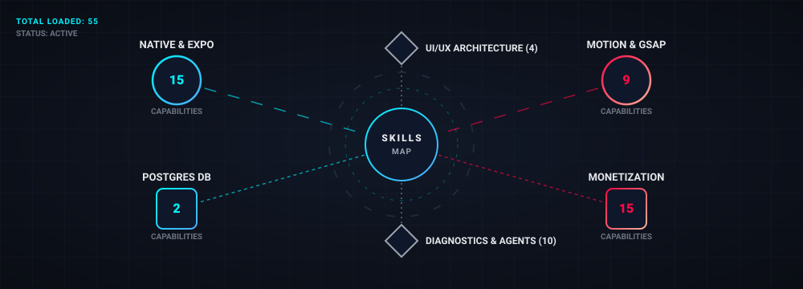

# Agent Capabilities Map

  

## Active Configurations

### 🎬 Motion & Animation (GSAP, Lottie)
* **GSAP Core & Extensions**: Hardware-accelerated timelines, scroll-driven scrubbing (`ScrollTrigger`), and multi-element choreographies.
* **dotLottie Runtime**: Web Worker offloading (`DotLottieWorker`), dynamic slot overriding (dotLottie 2.0 specs), and state machine event binding.
* *Skills*: `motion-design`, `dotlottie-web`, `gsap-*` suite (9 total).

### 📱 Native Mobile & Expo
* **Cross-Platform Bridges**: SwiftUI and Jetpack Compose native module generation mapped directly to React Native/Expo.
* **Architecture**: DOM Components (`use-dom`), API Routes (`app/+api.ts`), and brownfield integration.
* **Pipelines**: EAS update telemetry, CI/CD automated deployments, and App Clip configurations.
* *Skills*: `Expo UI *`, `expo-*` suite, `building-native-ui`, `native-data-fetching`, `eas-update-insights` (16 total).

### 📊 Monetization (RevenueCat, Superwall)
* **Subscription Engine**: Cross-platform StoreKit/Billing setup, entitlement gating, and legacy migration handling.
* **Paywall Orchestration**: Dynamic paywall rendering, A/B test triggers (Superwall), and self-serve customer centers.
* *Skills*: `revenuecat-*` suite, `superwall`, `superwall-editor` (15 total).

### 🎨 Frontend & UI Architecture
* **Design Systems**: Brutalist/neon/glassmorphic custom generation avoiding generic AI defaults. Generative algorithmic SVGs.
* **Modern Standards**: View Transitions, Container Queries, and `:has()` integrations.
* *Skills*: `frontend-design`, `algorithmic-art`, `design-an-interface`, `modern-web-guidance`, `app-screenshot-generator` (6 total).

### 🗄️ Database (Supabase, Postgres)
* **Performance**: GIN/Covering indexes, JSONB tuning, and transaction pooling (Supavisor).
* **Security & Concurrency**: PG Advisory Locks and optimized Row-Level Security (RLS) policies.
* *Skills*: `supabase`, `supabase-postgres-best-practices` (2 total).

### 🛠️ Diagnostics & Agent Tooling
* **Browser Instrumentation**: DevTools MCP integration for CPU/Memory profiling (Heap snapshots, LCP candidates) and a11y WCAG audits.
* **Swarm Config**: Google Antigravity SDK coordination and MCP/Skill scaffolding.
* *Skills*: `improve-codebase-architecture`, `chrome-devtools`, `memory-leak-debugging`, `google-antigravity-sdk`, `skill-creator`, `mcp-builder` (9 total).
