# Agent Capabilities Map

<p align="center">
  
</p>

<p align="center">
  
</p>

---

<details>
<summary><strong>📱 Native & Expo</strong> — 16 skills</summary>

<br>

**SwiftUI & Jetpack Compose bridges** that render native platform views directly from JS via `@expo/ui`. **DOM Components** (`'use dom'` directive) for embedding web-only libs (recharts, canvas, syntax highlighters) inside native apps via webview. **Expo Modules API** for writing Swift/Kotlin native code with type-safe JS bindings.

**Full deployment pipeline**: EAS Build/Submit CI/CD workflows, custom build steps, App Clip configuration with associated domains, custom dev clients for native module testing, and SDK upgrade automation with breaking-change checklists (React 19, New Architecture, expo-av→expo-audio migration).

**Networking layer**: React Query/SWR setup, token refresh flows, offline-first caching, and Expo Router data loaders. **EAS Update telemetry**: adoption rates, error tracking, rollback triggers.

```
expo-ui-swiftui · expo-ui-jetpack-compose · use-dom · expo-module
building-native-ui · expo-api-routes · expo-brownfield · expo-cicd-workflows
expo-deployment · expo-dev-client · expo-tailwind-setup · eas-update-insights
native-data-fetching · upgrading-expo · add-app-clip · android-cli
```

</details>

<details>
<summary><strong>🎬 Motion & Animation</strong> — 10 skills</summary>

<br>

**GSAP engine** with full plugin access (all plugins now free): ScrollTrigger scrub/pin/snap, ScrollSmoother, Flip layout animations, Draggable + Inertia, SplitText per-character animation, MorphSVG, DrawSVG, MotionPath, Physics2D, ScrambleText, and CustomEase. **React integration** via `useGSAP()` hook with context cleanup and SSR safety.

**Performance patterns**: transform/opacity-only animations, `will-change` management, `gsap.quickTo()` for 60fps mouse followers, batched read/write cycles, and ScrollTrigger lazy-loading.

**dotLottie runtime** with Web Worker offloading, state machines, and dynamic slot overriding. **Motion design theory**: timing/easing tables, choreography rules, stagger budgets, and motion personality archetypes. **Generative art** via p5.js with noise fields, particle systems, and mathematical pattern generation.

```
gsap-core · gsap-timeline · gsap-scrolltrigger · gsap-plugins
gsap-react · gsap-performance · gsap-utils
dotlottie-web · motion-design · algorithmic-art
```

</details>

<details>
<summary><strong>💰 Monetization</strong> — 15 skills</summary>

<br>

**RevenueCat full lifecycle**: project bootstrapping via MCP → SDK integration (iOS/Android/KMP/Flutter/RN) → product/entitlement/offering configuration → purchase flow implementation → paywall rendering (RevenueCatUI modal/gated/CTA) → entitlement gating with reactive listeners → customer identity management → self-serve Customer Center (cancel/refund/restore) → analytics dashboards (MRR, churn, conversion, retention) → testing setup (StoreKit sandbox, accelerated renewal) → troubleshooting (9-step checklist, debug logs) → migration from raw StoreKit/Play Billing via observer mode.

**Superwall**: REST API access, ClickHouse analytics, dynamic paywall rendering with A/B campaign triggers, and live paywall editing via CLI pairing with the browser-based editor.

```
revenuecat · create-revenuecat-project · integrate-revenuecat
revenuecat-purchase-flow · revenuecat-paywall · revenuecat-entitlements-gate
revenuecat-identify-user · revenuecat-customer-center · revenuecat-charts
revenuecat-status · revenuecat-testing-setup · revenuecat-troubleshoot
revenuecat-migrate · superwall · superwall-editor
```

</details>

<details>
<summary><strong>🎨 Frontend & Web</strong> — 5 skills</summary>

<br>

**Anti-slop design system generation**: distinctive typography, unexpected layouts, bold color/spatial composition — explicitly avoids generic AI defaults. **Parallel design exploration** via "Design It Twice" sub-agent workflow that spawns independent design attempts for comparison.

**App Store screenshot automation** with Python-scripted capture, framing, and annotation. **Chrome Extension development** with Manifest V3 (content scripts, service workers, side panels, `declarativeNetRequest`, Web Store publishing). **Modern web standards** — View Transitions, anchor positioning, container queries, scroll-driven animations, `:has()`, CWV optimization.

```
frontend-design · design-an-interface · app-screenshot-generator
chrome-extensions · modern-web-guidance
```

</details>

<details>
<summary><strong>🗄️ Database</strong> — 2 skills</summary>

<br>

**Supabase full stack**: Database, Auth, Edge Functions, Realtime, Storage, Vectors, Cron, Queues — with RLS security checklist (JWT auth, BOLA/IDOR prevention, `SECURITY DEFINER` risks, views bypassing RLS). **Postgres performance**: GIN/covering indexes, JSONB tuning, transaction pooling (Supavisor), PG Advisory Locks, `EXPLAIN` analysis, and 8-category optimization rules with incorrect-vs-correct SQL examples.

```
supabase · supabase-postgres-best-practices
```

</details>

<details>
<summary><strong>🛠️ Diagnostics & Agents</strong> — 9 skills</summary>

<br>

**Chrome DevTools MCP**: runtime debugging, network inspection, browser automation, CPU/memory profiling with heap snapshots, and connection troubleshooting. **LCP optimization** with Core Web Vitals drilling. **Accessibility audits** per web.dev (semantic HTML, ARIA, focus states, tap targets, contrast). **Memory leak diagnosis** via memlab and heap snapshot diffing.

**Agent architecture**: skill creation with eval loops and blind comparison testing, MCP server scaffolding (TypeScript/Python) with 4-phase build workflow, codebase architecture refactoring with deep-module analysis and ADR integration, and multi-agent orchestration via Google Antigravity SDK.

```
chrome-devtools · a11y-debugging · debug-optimize-lcp
memory-leak-debugging · troubleshooting
skill-creator · mcp-builder · improve-codebase-architecture
google-antigravity-sdk
```

</details>
