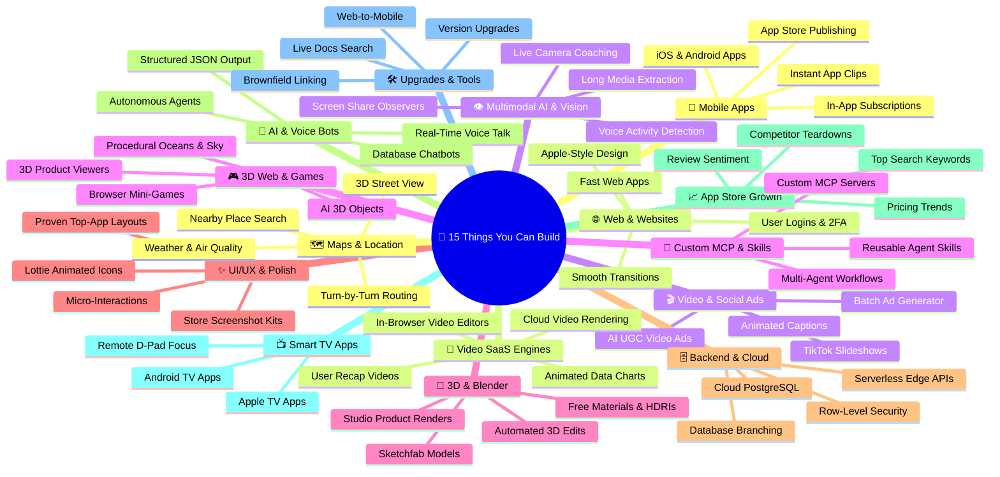

# ⚡ What You Can Build (Skills & Tools Map)

> A simple, plain-English guide to all the software, mobile apps, videos, 3D experiences, and AI tools you can build with your current setup.

---

## 🗺️ Visual Overview

---

## 📋 15 Real-World Categories & What You Can Build

---

### 1. 📱 Mobile App Development (iOS & Android)
Build, test, monetize, and publish native mobile applications for iPhones, iPads, and Android devices.

* **What you can build:**
  * **Complete Cross-Platform Apps:** High-performance native mobile apps from scratch using Expo and React Native.
  * **In-App Subscriptions & Paywalls:** Monthly/annual subscriptions, lifetime unlocks, and trial paywalls via RevenueCat & Superwall.
  * **Instant App Clips & Mini-Apps:** Lightweight app previews users can open instantly via QR codes or links without installing the full app.
  * **Instant Over-the-Air Updates:** Fix bugs and push new features directly to user phones via EAS Update without waiting days for App Store review.
  * **Automated Store Publishing:** Package, sign, and submit production builds directly to Apple App Store and Google Play Store.
* **Real-World Examples:** Subscription fitness trackers, productivity SaaS apps, e-commerce stores, social community apps.
* **Powered by:** `expo/skills`, `callstackincubator/agent-skills`, `RevenueCat MCP`, `superwall/skills`, `code-with-beto/skills`.

---

### 2. 🌐 Web Development & High-Performance Websites
Create modern, responsive, and high-performance websites and web applications.

* **What you can build:**
  * **Modern Web Applications:** Fast, responsive web apps tailored with Tailwind CSS, Next.js, Vite, and modern web frameworks.
  * **Apple-Grade Visual Polish:** Sleek dark modes, clean typography, glassmorphism, tailored color palettes, and balanced whitespace.
  * **Multi-Tenant User Logins & 2FA:** Full authentication with Google/GitHub OAuth, email magic links, passkeys, two-factor auth (TOTP), and team organization workspaces via Better Auth.
  * **Fluid View Transitions:** Zero-flicker animated page transitions that make multi-page navigation feel like a native app.
* **Real-World Examples:** SaaS web dashboards, client portals, marketing landing pages, interactive web utilities.
* **Powered by:** `Leonxlnx/taste-skill`, `better-auth/skills`, `emilkowalski/skills`, `vercel-labs/agent-skills`, `pbakaus/impeccable`.

---

### 3. 🎬 Social Media Video Ads & UGC Marketing
Create automated short-form vertical videos for **TikTok, YouTube Shorts, and Instagram Reels** to drive user acquisition.

* **What you can build:**
  * **AI Talking-Head UGC Ads:** Realistic AI creator video ads pitching your app’s benefits and hooks.
  * **Split-Screen App Demos:** AI talking creator on the top half with a live screen recording of your app in action on the bottom half.
  * **Viral TikTok Slideshows:** Automated 5-slide hook-and-problem carousels that convert viewers into app downloads.
  * **Auto-Animated Hormozi Captions:** Bouncy, word-by-word highlighted subtitles synced with voice audio.
  * **Batch Ad Variation Generator:** Render 20+ hook and call-to-action variations automatically to A/B test ad creatives.
* **Real-World Examples:** TikTok growth ads, Instagram Reels promos, YouTube Shorts tutorials, product launch trailers.
* **Powered by:** `heygen-com/hyperframes`, `remotion-dev/skills`, `diffusionstudio/lottie`.

---

### 4. 🎮 3D Web & Browser Game Development
Build interactive 3D experiences and lightweight games that run directly inside any modern web browser.

* **What you can build:**
  * **Interactive 3D Product Viewers:** 360-degree interactive 3D visualizers (e.g., custom sneaker configurators, 3D car exterior/interior inspect).
  * **Playable Browser Mini-Games:** 3D games with physics, particle effects, player movement controls, collision detection, and spatial audio.
  * **Procedural Environments:** Realistic oceans, animated cloud volumes, volumetric lighting, atmospheric fog, and dynamic shadows.
  * **Text-to-3D Objects:** Turn text descriptions or images into 3D models using generative AI and import them directly into Three.js scenes.
* **Real-World Examples:** 3D product landing pages, interactive browser mini-games, virtual real estate tours, web VR experiments.
* **Powered by:** `majidmanzarpour/threejs-game-skills`, `scottstts/Threejs-Awesome-Graphics-Agent-Skills`, `diffusionstudio/lottie`.

---

### 5. 🎨 3D Modeling & Studio Asset Creation (Blender)
Create, edit, texture, and render 3D scenes and assets programmatically or interactively.

* **What you can build:**
  * **Automated 3D Scene Manipulation:** Inspect meshes, fix topology, position objects, and run automated Python modeling scripts.
  * **Free Photorealistic Materials & HDRIs:** Automatically search, download, and apply PolyHaven textures, PBR materials, and HDRI lighting backgrounds.
  * **Sketchfab Model Downloader:** Search and download thousands of 3D models directly into your 3D workflow.
  * **Studio Product Renders:** Render photorealistic product hero shots, marketing images, and viewport camera animations.
* **Real-World Examples:** 3D app mockups, high-resolution product imagery, game-ready 3D prop libraries, architectural visualizations.
* **Powered by:** `Blender MCP`, `PolyHaven API`, `Sketchfab API`, `Hunyuan3D & Hyper3D AI`.

---

### 6. ✨ UI/UX Design & High-End Visual Polish
Make apps and websites feel smooth, responsive, anti-slop, and visually stunning.

* **What you can build:**
  * **Top App Pattern Replication:** Study and adopt verified layout patterns from top-earning iOS apps (Linear, Airbnb, Apple) using Appllama.
  * **Physics-Based Micro-Interactions:** Smooth bouncy buttons, dynamic gestures, spring animations, and tactile feedback via GSAP and Reanimated.
  * **Lightweight Lottie Vector Animations:** Animated checkmarks, interactive icons, celebration confetti, and loading states.
  * **App Store & Play Store Screenshot Kits:** Generate beautiful promotional screenshots complete with 3D device frames, gradient backgrounds, and marketing copy.
* **Real-World Examples:** Mobile onboarding flows, App Store listing artwork, high-converting checkout screens, polished design systems.
* **Powered by:** `Appllama/appllama-skills`, `Leonxlnx/taste-skill`, `emilkowalski/skills`, `greensock/gsap-skills`, `LottieFiles/motion-design-skill`, `beyg1/App-ScreenShots-Generator-Skill`.

---

### 7. 🗄️ Backend, Cloud Infrastructure & Databases
Set up the server infrastructure, database models, and security layers that power your apps behind the scenes.

* **What you can build:**
  * **Cloud PostgreSQL Databases:** Fully managed SQL databases with tables, foreign keys, and indexes via Supabase and Neon.
  * **Row-Level Security (RLS):** Bulletproof access policies ensuring users can only read and write their own authorized data.
  * **Instant Database Branching:** Create instant isolated database clones for pull requests or testing without risking production data.
  * **Serverless APIs & Edge Functions:** Globally distributed Edge Functions and serverless backends that scale automatically without server management.
* **Real-World Examples:** Multi-tenant SaaS databases, realtime messaging backends, serverless REST/GraphQL APIs, user profile data stores.
* **Powered by:** `Supabase MCP`, `neondatabase/agent-skills`, `cloudflare/skills`, `mongodb/agent-skills`.

---

### 8. 🧠 AI Agents, Voice Bots & Smart Assistants
Build smart conversational AI features, voice agents, and autonomous developer workflows.

* **What you can build:**
  * **Real-Time Voice Talk:** Ultra-low-latency bidirectional conversational voice bots that feel like talking to a real human.
  * **Database-Grounded Chatbots:** AI assistants that query live database tables and return accurate, real-time answers.
  * **Autonomous Coding Agents:** Multi-step agents that investigate problems, run commands, create files, and test software end-to-end.
  * **Structured JSON Extractors:** Extract reliable, schema-validated data from unformatted text, emails, and documents.
* **Real-World Examples:** Voice customer service agents, AI coding copilot workflows, internal knowledge base Q&A bots, automated research assistants.
* **Powered by:** `gemini-live-api-dev`, `gemini-interactions-api`, `google-antigravity-sdk`, `firebase-ai-logic-basics`.

---

### 9. 📈 App Store Growth & Competitor Intelligence (ASO)
Get more organic downloads and uncover competitive opportunities on the App Store and Google Play.

* **What you can build:**
  * **High-Impact Keyword Research:** Discover high-volume, low-competition keywords to rank #1 on Apple App Store & Google Play.
  * **Competitor Review Sentiment Analysis:** Mine competitor 1-star and 2-star reviews to pinpoint missing features and user pain points.
  * **Competitor Pricing & Update Tracking:** Monitor competitor price changes, in-app purchases, and release cadences over time.
  * **Category & Market Benchmarking:** Identify top-grossing app categories and optimize your app metadata for maximum visibility.
* **Real-World Examples:** ASO audit reports, competitor teardowns, keyword ranking strategies, market opportunity analysis.
* **Powered by:** `AppReply ASO MCP`, `RevenueCat MCP`.

---

### 10. 📺 Smart TV & Big-Screen Apps
Build applications tailored specifically for living room television screens.

* **What you can build:**
  * **Apple TV (tvOS) & Android TV Apps:** Big-screen TV applications built on React Native & Expo.
  * **D-Pad & Remote Control Navigation:** Seamless directional focus management, spatial navigation, and highlight states for TV remotes.
  * **Media Streaming & Living Room Interfaces:** 10-foot UI layouts optimized for high contrast, readability from couch distance, and video playback.
* **Real-World Examples:** Video streaming dashboards, fitness workout TV apps, digital signage displays, dashboard monitoring screens.
* **Powered by:** `callstackincubator/agent-skills` (`react-native-tv-best-practices`), `expo/skills`.

---

### 11. 🛠️ Code Upgrades, Migrations & Dev Tooling
Keep codebases clean, maintainable, up-to-date, and well-architected.

* **What you can build:**
  * **Automated Version Upgrades:** Upgrade legacy Expo and React Native projects to the latest SDK versions with zero breaking changes.
  * **Web-to-Native Conversion:** Package existing responsive web apps into production-ready native mobile applications.
  * **Brownfield Native Integration:** Embed React Native modules seamlessly into existing Swift / Kotlin / Java native codebases.
  * **Live Documentation Grounding:** Query up-to-date documentation for hundreds of developer libraries to prevent deprecated code.
* **Real-World Examples:** Legacy codebase modernizations, React Native library boilerplate generator, automated code refactorings.
* **Powered by:** `callstackincubator/agent-skills`, `expo/skills`, `context7 MCP`, `mattpocock/skills`, `xcode-project-setup`.

---

### 12. 🗺️ Location-Based, Maps & Navigation Apps
Build rich location-aware mobile and web apps with interactive maps, turn-by-turn routing, and environmental intelligence.

* **What you can build:**
  * **Interactive Place Locators & Nearby Search:** Search nearby businesses, restaurants, or properties with opening hours, photos, and ratings.
  * **Turn-by-Turn Routing & ETA Engine:** Calculate driving, walking, cycling, and eco-friendly routes with live travel time estimates.
  * **3D Maps & Street View Exploration:** Embed interactive 3D map views and Google Street View panoramas inside mobile and web apps.
  * **Environmental Data Heatmaps:** Overlay real-time air quality indices, pollen counts, and solar rooftop data directly onto live maps.
* **Real-World Examples:** Delivery & courier tracking apps, real estate portals, travel itinerary guides, fitness run trackers.
* **Powered by:** `google-maps-platform`, `remotion-maps`.

---

### 13. 🎥 Programmatic Video SaaS & Cloud Rendering Engines
Build cloud-based video generation software, automated rendering pipelines, and interactive web video tools.

* **What you can build:**
  * **Backend Video Generation APIs:** Automatically render dynamic MP4 videos on cloud servers from JSON data or API triggers.
  * **Personalized User Recap Videos:** Generate personalized "Year in Review" or monthly milestone videos for each user in your database.
  * **In-Browser Interactive Video Editors:** Web-based video timeline editors where users can customize text, images, and audio tracks.
  * **Automated Chart & Report Highlights:** Convert live analytical charts and performance metrics into polished video presentations.
* **Real-World Examples:** Video creation SaaS platforms, automated real estate listing tours, automated gaming highlight reel generators.
* **Powered by:** `remotion-dev/skills` (`remotion-saas`, `remotion-render`, `remotion-studio`), `heygen-com/hyperframes`.

---

### 14. 👁️ Multimodal AI, Live Vision & Real-Time Audio Streaming
Build advanced AI features that process live camera video streams, computer screens, and low-latency bidirectional voice audio.

* **What you can build:**
  * **Live Camera & Screen Observers:** AI that inspects live camera feeds or screen shares in real time to provide immediate coaching or inspection.
  * **Interruptible Voice-to-Voice Pipelines:** Real-time conversational AI with instant Voice Activity Detection (VAD) and natural interruption handling.
  * **Multimodal Document & Media Extractors:** Ingest hours of video, audio recordings, or complex PDFs and extract structured data insights.
  * **Live UI & Code Assistance:** Real-time visual debugger that watches you code or design and spots visual bugs instantaneously.
* **Real-World Examples:** Live workout form coaching apps, AI visual customer support, real-time language interpreters, smart CCTV security assistants.
* **Powered by:** `gemini-live-api-dev`, `gemini-interactions-api`, `firebase-ai-logic-basics`.

---

### 15. 🧩 Custom MCP Server & AI Agent Tool Builder
Build custom tools, connect AI assistants to private infrastructure, and engineer autonomous multi-agent systems.

* **What you can build:**
  * **Custom MCP Servers:** Author and deploy new MCP servers that connect AI assistants to proprietary company databases and private APIs.
  * **Custom Agent Skills:** Package repetitive developer procedures and organizational knowledge into reusable agent skill modules.
  * **Autonomous Multi-Agent Orchestration:** Build multi-agent systems where specialized AI sub-agents collaborate to solve complex engineering tasks.
  * **Tool Discovery & Auto-Configuration:** Automatically identify, install, and wire up optimal agent skills for new projects.
* **Real-World Examples:** Enterprise internal AI tooling, custom developer IDE extensions, automated customer support sub-agents.
* **Powered by:** `anthropics/skills` (`mcp-builder`, `skill-creator`), `google-antigravity-sdk`, `vercel-labs/skills` (`find-skills`).

---

## 💡 15-Category Summary Table

| # | Category | Core Outcome | What It Replaces / Saves |
| :---: | :--- | :--- | :--- |
| **1** | 📱 **Mobile Apps** | Ready-to-publish iOS & Android apps with monetization | Separate iOS & Android mobile dev teams |
| **2** | 🌐 **Web Apps** | Modern, polished websites with secure logins & 2FA | Weeks of frontend and authentication boilerplate |
| **3** | 🎬 **Social Video Ads** | TikTok/Shorts ads & automated UGC marketing clips | Expensive video production agencies & camera gear |
| **4** | 🎮 **3D & Web Games** | Interactive 3D websites & browser mini-games | Complex game engine setups & WebGL boilerplate |
| **5** | 🎨 **Blender 3D** | Automated 3D meshes, studio lighting & product renders | Hours of manual 3D modeling & rendering work |
| **6** | ✨ **UI/UX Design** | Apple-grade animations, micro-interactions & screenshots | Expensive UI/UX agencies |
| **7** | 🗄️ **Backend & Cloud** | Secure PostgreSQL databases, RLS rules & Edge functions | Dedicated backend DevOps engineers |
| **8** | 🧠 **AI & Voice Bots** | Real-time voice assistants & smart database chatbots | Complex AI orchestration pipelines from scratch |
| **9** | 📈 **App Store Growth** | High keyword rankings & competitor teardowns | Costly monthly ASO subscription tools |
| **10** | 📺 **Smart TV Apps** | Apple TV & Android TV applications with D-pad focus | Specialized TV app developers |
| **11** | 🛠️ **Code Tooling** | Automated SDK upgrades & web-to-mobile conversion | Days of manual debugging & framework migrations |
| **12** | 🗺️ **Maps & Location** | Interactive places search, routing & environmental maps | Complex GIS mapping setups & custom routing engines |
| **13** | 🎥 **Video SaaS Engines** | Backend cloud video rendering APIs & user recap clips | High-overhead manual video editing teams |
| **14** | 👁️ **Multimodal AI** | Live camera coaching, screen observers & voice streaming | Multi-model pipeline engineering from scratch |
| **15** | 🧩 **Custom MCP & Skills** | Custom MCP servers & reusable company agent skills | Custom internal API integration engineering |

---

## 🚀 How to Explore

Open [`index.html`](file:///home/darth/Playground/Skills%20Map/index.html) in your browser to view all tools in an interactive 3D visual dashboard.
