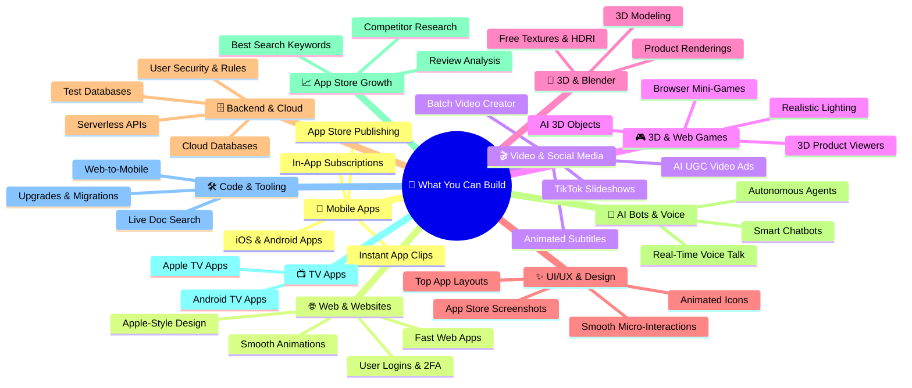

# ⚡ What You Can Build (Skills & Tools Map)

> A simple guide to all the software, apps, videos, and tools you can build with your current setup.

---

## 🗺️ Visual Overview

---

## 📋 11 Categories & Real-World Use Cases (Plain English)

---

### 1. 📱 Mobile App Development (iOS & Android)
Build, test, and publish complete mobile apps for iPhones and Android devices.

* **Complete Mobile Apps**: Create fast mobile apps from scratch with Expo and React Native.
* **In-App Subscriptions & Paywalls**: Add monthly/yearly subscriptions and paywalls to make money from your apps.
* **Instant App Clips**: Let users try parts of your app immediately without installing it first.
* **Instant Over-the-Air Updates**: Fix bugs and push new features directly to user phones without waiting for App Store approval.
* **App Store & Play Store Publishing**: Package, build, and deploy apps directly to Apple and Google stores.

---

### 2. 🌐 Web Development & Websites
Create modern, clean, and high-performance websites and web applications.

* **Modern Web Applications**: Build fast web apps with responsive layouts that look great on phones, tablets, and desktops.
* **Apple-Style Polish**: Design high-end websites with clean typography, dark modes, and subtle gradients.
* **Secure User Accounts**: Add user logins with Google, email, two-factor authentication (2FA), and team permissions.
* **Fluid Page Transitions**: Make pages load and transition smoothly with zero jarring flickers.

---

### 3. 🎬 Video Creation & Social Media Marketing
Create automated short-form vertical videos for **TikTok, YouTube Shorts, and Instagram Reels** to get users for your apps.

* **AI Talking-Head Ads (UGC)**: Make realistic AI creator videos that talk about your app and its benefits.
* **Split-Screen Videos**: Show an AI talking head on top and your live mobile app demo on the bottom.
* **Viral TikTok Slideshows**: Automatically create 5-slide problem-solving slideshows that drive people to download your app.
* **Auto Animated Captions**: Generate bouncy, word-by-word highlighted subtitles (Hormozi / TikTok style).
* **Batch Video Generator**: Automatically generate 20+ video variations with different hooks to test which one gets the most views.

---

### 4. 🎮 3D Web & Browser Game Development
Build interactive 3D experiences and lightweight games that run directly inside any web browser.

* **3D Product Visualizers**: Create interactive 3D viewers (e.g., customize car colors, spin 3D shoes, inspect items).
* **Browser 3D Mini-Games**: Build playable 3D games with player controls, physics, collision detection, and sound.
* **Realistic Weather & Nature**: Add realistic oceans, moving clouds, sunlight, and shadows to web pages.
* **Text-to-3D Objects**: Turn text descriptions or images into 3D models using generative AI.

---

### 5. 🎨 3D Modeling & Asset Creation (Blender)
Create, edit, and render 3D scenes and assets.

* **Automated 3D Edits**: Edit 3D models, fix meshes, and adjust object positions with simple commands.
* **Free Materials & HDRIs**: Automatically download and apply free realistic textures, materials, and lighting backgrounds.
* **Product Renders**: Render clean, studio-quality images and video clips of 3D products.

---

### 6. ✨ UI/UX Design & Visual Polish
Make apps and websites feel smooth, responsive, and visually stunning.

* **Copy Proven Layouts**: Look up how top apps (like Linear, Apple, Airbnb) design their screens and use those patterns.
* **Micro-Animations**: Add bouncy buttons, smooth tab switches, and animated menus that feel alive.
* **Animated Icons (Lottie)**: Add lightweight animated checkmarks, download buttons, and loading spinners.
* **App Store Marketing Screenshots**: Generate beautiful App Store screenshots with 3D device frames and clean text.

---

### 7. 🗄️ Backend, Cloud & Databases
Set up the server infrastructure that powers your apps behind the scenes.

* **Cloud Databases**: Set up secure PostgreSQL databases to store user data, products, and messages.
* **User Data Protection**: Ensure users can only see and edit their own private data with security rules (RLS).
* **Serverless APIs**: Run backend code and Edge Functions that scale automatically without managing servers.
* **Safe Database Testing**: Make instant copies of your database to test changes safely before touching live user data.

---

### 8. 🧠 AI Agents, Voice Bots & Smart Assistants
Build smart AI features and voice assistants.

* **Real-Time Voice Assistant**: Create assistants you can talk to with your voice in real time with zero awkward pauses.
* **Smart Database Chatbots**: Build chatbots that answer user questions using your app’s live data.
* **Self-Running AI Agents**: Set up agents that can research, write code, test bugs, and run commands autonomously.

---

### 9. 📈 App Store Growth & Competitor Research (ASO)
Get more organic downloads on the App Store and Google Play.

* **Find Top Search Keywords**: Discover what words people search for most so your app ranks at the top.
* **Analyze Competitor Reviews**: Read competitor reviews to see what users complain about, then build the solution into your app.
* **Track Pricing & Updates**: Monitor how competitor apps change their prices and features over time.

---

### 10. 📺 Smart TV & Big-Screen Apps
Build apps designed for the living room.

* **Apple TV & Android TV Apps**: Create apps that work smoothly on big television screens.
* **Remote Control Navigation**: Ensure buttons, menus, and focus states work seamlessly with standard TV remotes.

---

### 11. 🛠️ Code Upgrades, Migrations & Dev Tools
Keep your code clean, up to date, and easy to maintain.

* **Upgrade Old Codebases**: Automatically upgrade older Expo or React Native projects to the newest version.
* **Turn Websites into Mobile Apps**: Wrap and convert existing web apps into native mobile apps.
* **Zero-Mistake Library Docs**: Search up-to-date documentation for any coding library to prevent outdated code.

---

## 💡 Summary Table

| Category | Main Outcome | What It Replaces / Saves |
| :--- | :--- | :--- |
| **1. Mobile Apps** | Ready-to-publish iOS & Android apps | Hiring a separate iOS & Android mobile dev team |
| **2. Web Apps** | Modern, polished websites with logins | Weeks of frontend and auth setup |
| **3. Video Creation** | TikTok/Shorts ads & automated UGC | Expensive video editors & camera gear |
| **4. 3D & Web Games** | Interactive 3D websites & mini-games | Complex game engine setups |
| **5. Blender 3D** | 3D models, textures, and product shots | Manual 3D modeling work |
| **6. UI/UX Design** | Apple-grade animations & store screenshots | Expensive UI design agencies |
| **7. Backend & Cloud** | Secure databases & serverless APIs | Dedicated backend DevOps engineers |
| **8. AI & Voice Bots** | Real-time voice assistants & smart bots | Building complex AI pipelines from scratch |
| **9. App Store Growth** | High keyword rankings & competitor intel | Paying for expensive ASO marketing tools |
| **10. TV Apps** | Apple TV & Android TV apps | Specialized TV app developers |
| **11. Code Tools** | Fast upgrades & web-to-mobile conversion | Days of manual debugging & migrations |

---

## 🚀 How to Explore

Open [`index.html`](file:///home/darth/Playground/Skills%20Map/index.html) in your browser to view all tools in an interactive 3D visual dashboard.
