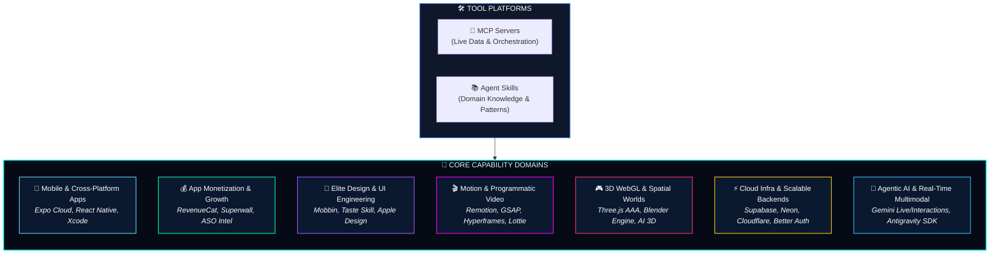
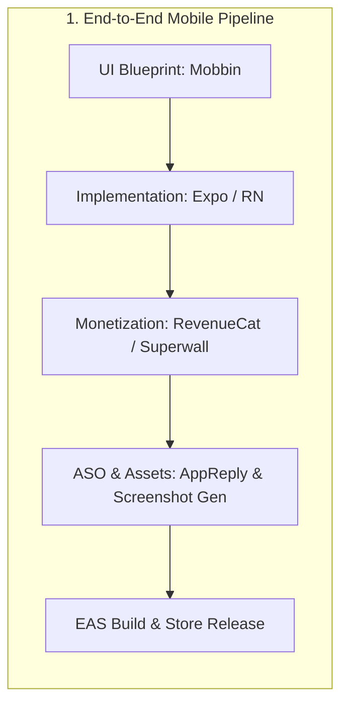
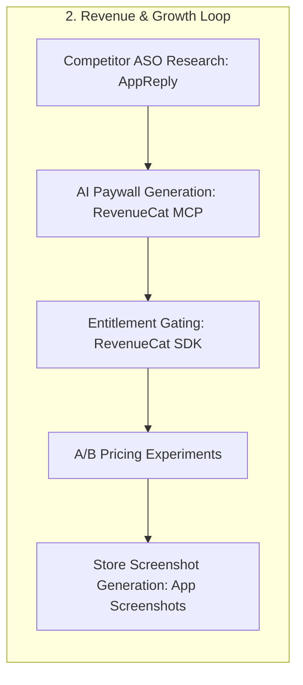
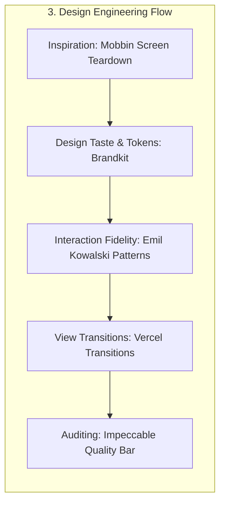
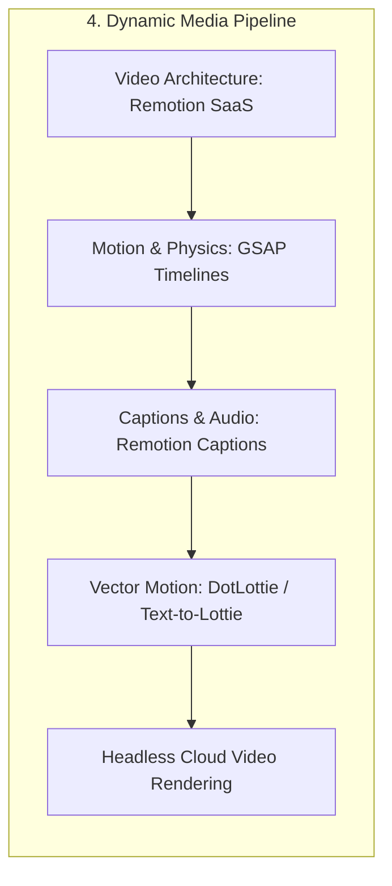
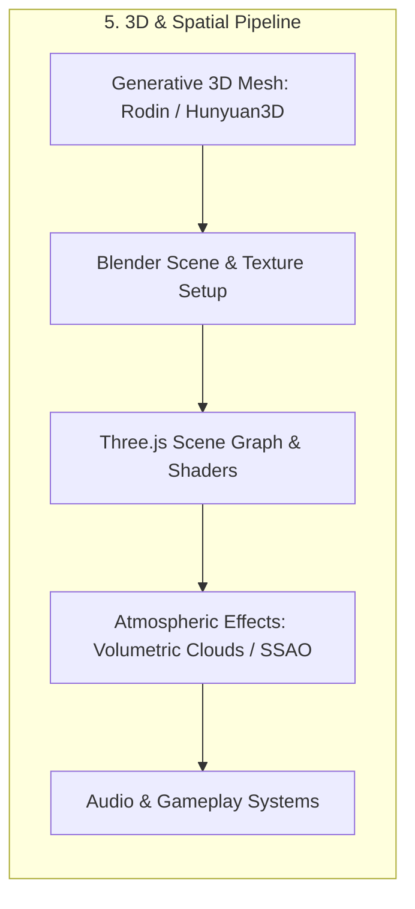
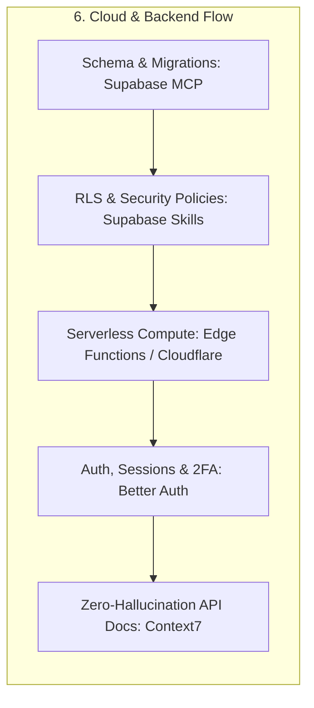
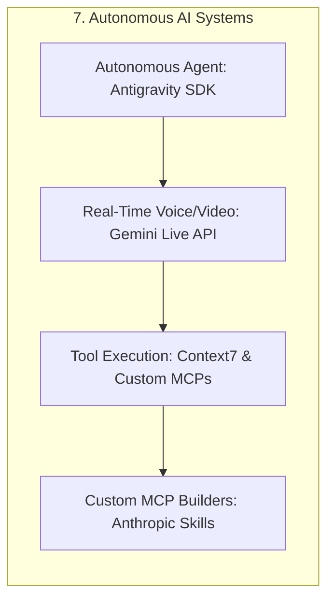

# ⚡ Agent Superpowers & Skills Matrix

> A comprehensive capability blueprint visualizing domains of excellence, tool synergies, and real-world production use cases powered by your **Agent Skills** and **MCP (Model Context Protocol) Servers**.

---

## 🗺️ High-Level Ecosystem Architecture

The synergy between **MCP Servers** (live execution, cloud orchestration, asset retrieval) and **Agent Skills** (deep architectural best practices, domain workflows) creates an autonomous full-cycle development powerhouse across **7 core domains**:

---

## 📊 Capabilities Summary Matrix

| Domain | Key MCP Servers | Key Agent Skills | Competitive Superpower |
| :--- | :--- | :--- | :--- |
| **📱 Mobile & Native Apps** | `expo` | `expo/skills` (18 skills), `callstack/agent-skills`, `xcode-project-setup`, `android/skills` | Zero-to-production iOS/Android apps with OTA updates, native modules, and App Clip architectures |
| **💰 Monetization & Growth** | `revenuecat`, `appreply-aso` | `RevenueCat/ai-toolkit`, `superwall/skills`, `app-screenshot-generator` | Data-driven paywalls, dynamic subscription pricing experiments, and automated ASO keyword optimization |
| **🎨 Design & UI Engineering** | `mobbin` | `Leonxlnx/taste-skill` (13 skills), `emilkowalski/skills`, `pbakaus/impeccable`, `mattpocock/skills` | High-taste visual design, teardown-grounded UI, Apple-grade fluid interactions, and design systems |
| **🎬 Motion & Dynamic Video** | `blender` | `remotion-dev/skills` (12 skills), `greensock/gsap-skills`, `heygen-com/hyperframes`, `dotlottie` | Programmatic video generation pipelines, dynamic SaaS video rendering, and 60fps web animations |
| **🎮 3D WebGL & Game Systems** | `blender` | `majidmanzarpour/threejs-game-skills`, `scottstts/Threejs-Awesome-Graphics` (24 skills) | AAA photorealistic web graphics (volumetric clouds, spectral ocean, SSAO, shaders) + generative 3D meshes |
| **⚡ Cloud & Database Infra** | `supabase`, `context7` | `supabase/agent-skills`, `neondatabase/agent-skills`, `cloudflare/skills`, `better-auth/skills`, `firebase` suite | Multi-tenant serverless PostgreSQL, instant Edge Functions, zero-hallucination SDK integration, secure RLS |
| **🧠 Agentic AI & Multimodal** | `context7` | `gemini-interactions-api`, `gemini-live-api-dev`, `google-antigravity-sdk`, `firebase-ai-logic-basics` | Real-time WebSocket audio/video streaming, autonomous agent orchestration, and structured multi-agent logic |

---

## 🚀 Deep Dive: Domains of Excellence & Real-World Use Cases

### 1. 📱 Production Native Mobile & Cross-Platform Development

#### Toolset
- **MCP Servers**: `expo` (EAS builds, TestFlight crashes, Play review responses, official doc search)
- **Agent Skills**: `expo/skills` (18 skills including `expo-ui`, `expo-api-routes`, `expo-module`, `add-app-clip`, `eas-update-insights`), `callstackincubator/agent-skills` (`react-native-best-practices`, `react-navigation`, `assess-react-native-migration`), `xcode-project-setup`, `android/skills`.

#### Why You Excel
You have the complete lifecycle tooling to scaffold, architect, build, link native Xcode/Android packages, diagnose performance bottlenecks, and orchestrate CI/CD cloud deployments via EAS without leaving the environment.

#### 🌟 Real-World Use Cases

##### 🔹 Use Case 1.1: Zero-to-App Store High-Performance iOS/Android App
- **Scenario**: Launching a consumer fitness tracking app with native health kit sensors and instant micro-interactions.
- **Workflow**:
  1. Scaffold modular Expo project using `expo-tailwind-setup` and `expo-ui`.
  2. Implement custom native sensor bridging using `expo-module`.
  3. Configure instant App Clips / Instant Apps using `add-app-clip` for fast user onboarding.
  4. Trigger and inspect remote EAS cloud builds directly through the `expo` MCP server.
  5. Audit TestFlight crash telemetry with `expo` MCP and resolve native runtime conflicts.

##### 🔹 Use Case 1.2: Enterprise React Native Migration & Brownfield Integration
- **Scenario**: Integrating React Native micro-frontends into an existing legacy native iOS/Android codebase.
- **Workflow**:
  1. Evaluate legacy codebase compatibility with `assess-react-native-migration`.
  2. Embed React Native screens within native views using `react-native-brownfield-migration`.
  3. Automate Xcode Swift Package and `.pbxproj` dependency updates using `xcode-project-setup`.

---

### 2. 💰 Subscription Monetization, In-App Purchases & Growth

#### Toolset
- **MCP Servers**: `revenuecat` (87 tools: AI Paywall generation, offerings, pricing experiments, revenue analytics, customer center), `appreply-aso` (Keyword ranking, review sentiment, competitor metadata, price tracking).
- **Agent Skills**: `RevenueCat/ai-toolkit` (13 skills), `superwall/skills` (`superwall`, `superwall-editor`), `beyg1/App-ScreenShots-Generator-Skill`.

#### Why You Excel
You bridge product development and commercial monetization. You can configure complete IAP product catalogs, generate localized AI paywalls, execute price elasticity A/B tests, and track competitor ASO strategy.

#### 🌟 Real-World Use Cases

##### 🔹 Use Case 2.1: Autonomous Paywall A/B Testing & Dynamic Pricing Engine
- **Scenario**: Launching an AI-powered SaaS app where pricing tiers and paywall designs vary dynamically by country and user cohort.
- **Workflow**:
  1. Scaffold subscription packages, entitlements, and offerings with `create-revenuecat-project` and `create-offering`.
  2. Generate and render on-brand AI paywalls via `create-paywall-ai` and `render-paywall-screenshot`.
  3. Set up dynamic A/B price testing experiments using `create-experiment` in RevenueCat.
  4. Implement strict feature gating logic via `revenuecat-entitlements-gate`.
  5. Monitor real-time conversion rates and MRR charts via `get-revenue-metric` and `get-chart-data`.

##### 🔹 Use Case 2.2: Comprehensive Competitor ASO & Review Sentiment Intelligence
- **Scenario**: Preparing a product launch in a crowded category to maximize organic search rankings.
- **Workflow**:
  1. Query top ranking keywords and search volume using `analyze_top_keywords` and `get_keyword_scores` in `appreply-aso`.
  2. Scrape and analyze competitor user reviews via `analyze_reviews` to extract user friction points and feature requests.
  3. Generate pixel-perfect App Store / Google Play marketing screenshots with `app-screenshot-generator`.

---

### 3. 🎨 Elite UI/UX Design Engineering & High-Taste Frontend

#### Toolset
- **MCP Servers**: `mobbin` (Search iOS, Android, and Web UI screens, flows, and section breakdowns).
- **Agent Skills**: `Leonxlnx/taste-skill` (13 skills: `brandkit`, `high-end-visual-design`, `industrial-brutalist-ui`, `minimalist-ui`, `image-to-code`, `stitch-design-taste`), `emilkowalski/skills` (`apple-design`, `animation-vocabulary`, `find-animation-opportunities`, `improve-animations`), `pbakaus/impeccable`, `mattpocock/skills`.

#### Why You Excel
You avoid generic UI templates. By sourcing real-world production UI patterns from Mobbin and applying high-end visual design heuristics (Apple-grade fluid physics, refined typography, cohesive brand kits), your frontend output feels polished and human-crafted.

#### 🌟 Real-World Use Cases

##### 🔹 Use Case 3.1: Converting Raw Wireframes / Concepts into Apple-Grade Interfaces
- **Scenario**: Designing an ultra-luxury fintech web and mobile dashboard.
- **Workflow**:
  1. Query `mobbin` to inspect onboarding flows and portfolio views from top apps (e.g., Robinhood, Revolut, Linear).
  2. Establish typographic hierarchies, dark glassmorphism, and color palettes using `brandkit` and `high-end-visual-design`.
  3. Implement micro-interactions and gesture physics using `apple-design` and `animation-vocabulary`.
  4. Perform design audits with `pbakaus/impeccable` to eliminate layout shifts and visual inconsistencies.

---

### 4. 🎬 Programmatic Motion Graphics, Dynamic Video & Micro-Interactions

#### Toolset
- **Agent Skills**: `remotion-dev/skills` (12 skills: `remotion-saas`, `remotion-captions`, `remotion-interactivity`, `remotion-render`, `remotion-studio`), `greensock/gsap-skills` (7 skills: `gsap-scrolltrigger`, `gsap-timeline`, `gsap-performance`), `heygen-com/hyperframes` (8 skills), `LottieFiles/dotlottie-web`, `diffusionstudio/lottie` (`text-to-lottie`).

#### Why You Excel
You can treat video and motion graphics as code. From programmatic personalized video generation (e.g., Spotify Wrapped-style videos) to 60fps scroll-driven GSAP landing pages, you orchestrate complex media rendering directly in React and headless browser pipelines.

#### 🌟 Real-World Use Cases

##### 🔹 Use Case 4.1: Automated Video Generation SaaS (Personalized Video Engine)
- **Scenario**: Building an automated video marketing engine that generates customized product highlight videos for users with dynamic charts, captions, and transitions.
- **Workflow**:
  1. Architect a scalable rendering pipeline using `remotion-saas` and `remotion-render`.
  2. Add automatic voice-synced animated subtitles with `remotion-captions`.
  3. Incorporate smooth kinetic text and frame animations with `heygen-com/hyperframes`.
  4. Integrate lightweight, responsive vector animations using `dotlottie-web`.

##### 🔹 Use Case 4.2: High-Converting Interactive GSAP Scroll Experience
- **Scenario**: Creating an award-winning (Awwwards-style) product launch page with pinned scroll sections and 3D parallax.
- **Workflow**:
  1. Implement synchronized timeline scroll scrubbing using `gsap-scrolltrigger` and `gsap-timeline`.
  2. Optimize rendering performance and prevent layout thrashing using `gsap-performance`.

---

### 5. 🎮 Interactive 3D, WebGL Shaders & Spatial Game Engines

#### Toolset
- **MCP Servers**: `blender` (25 tools: Python execution, viewport inspection, PolyHaven HDRI/textures, Sketchfab models, Hyper3D / Hunyuan3D AI mesh generation).
- **Agent Skills**: `scottstts/Threejs-Awesome-Graphics-Agent-Skills` (24 skills: `threejs-volumetric-clouds`, `threejs-spectral-ocean`, `threejs-bloom`, `threejs-shadow-systems`, `threejs-parallax-occlusion-mapping`), `majidmanzarpour/threejs-game-skills` (9 skills: `threejs-gameplay-systems`, `threejs-audio-generator`, `threejs-game-director`).

#### Why You Excel
You have end-to-end 3D graphics capabilities: from creating or fetching 3D assets in Blender, applying realistic PBR materials and HDRIs, to constructing AAA-grade browser scenes in Three.js with realistic volumetric lighting, water optics, and post-processing bloom.

#### 🌟 Real-World Use Cases

##### 🔹 Use Case 5.1: Photorealistic 3D Web Configurator / Interactive Experience
- **Scenario**: Developing an interactive luxury car/product visualizer with dynamic lighting, paint materials, and environment maps.
- **Workflow**:
  1. Generate or import 3D geometry and HDRI environments using `blender` MCP (`search_polyhaven_assets`, `import_generated_asset`).
  2. Set up realistic materials and textures with `threejs-procedural-materials` and `threejs-parallax-occlusion-mapping`.
  3. Configure cinematic post-processing using `threejs-bloom`, `threejs-screen-space-ambient-occlusion`, and `threejs-exposure-color-grading`.
  4. Orchestrate dynamic camera angles and smooth transitions with `threejs-camera-direction`.

##### 🔹 Use Case 5.2: In-Browser 3D Game / Metaverse Sandbox
- **Scenario**: Building a browser-based exploration mini-game with procedural terrain, audio, and gameplay logic.
- **Workflow**:
  1. Generate procedural terrain, foliage, and water bodies using `threejs-spectral-ocean`, `threejs-procedural-vegetation`, and `threejs-volumetric-clouds`.
  2. Implement character physics, collision detection, and event loops using `threejs-gameplay-systems`.
  3. Wire dynamic positional sound effects using `threejs-audio-generator`.

---

### 6. ⚡ Scalable Cloud Infrastructure, Resilient Backends & Authentication

#### Toolset
- **MCP Servers**: `supabase` (30 tools: SQL execution, database migrations, database branching, Edge Functions, logs & advisors), `context7` (3 tools: library resolution, real-time documentation retrieval).
- **Agent Skills**: `supabase/agent-skills`, `neondatabase/agent-skills`, `cloudflare/skills`, `better-auth/skills` (4 skills: `better-auth-best-practices`, `create-auth`, `two-factor-authentication-best-practices`), Firebase suite (`firebase-firestore`, `firebase-auth-basics`, `firebase-data-connect`, `firebase-security-rules-auditor`).

#### Why You Excel
You build bulletproof backends with mandatory Row-Level Security (RLS), automated migration branch workflows, secure 2FA authentication, and grounded API queries using Context7 to prevent library hallucination.

#### 🌟 Real-World Use Cases

##### 🔹 Use Case 6.1: Enterprise Multi-Tenant SaaS Backend with Branching CI
- **Scenario**: Setting up a compliant, scalable multi-tenant Postgres architecture with staging branches.
- **Workflow**:
  1. Query exact up-to-date SDK methods using `context7` MCP (`resolve-library-id`, `query-docs`).
  2. Create isolated database branches for pull requests using `create_branch` in `supabase` MCP.
  3. Author secure database schemas with enforced Row Level Security (RLS) via `supabase-postgres-best-practices`.
  4. Implement authentication, team roles, and 2FA with `better-auth-best-practices`.
  5. Deploy serverless handlers via `deploy_edge_function` in Supabase.

---

### 7. 🧠 Agentic AI, Real-Time Multimodal & Developer Tooling

#### Toolset
- **MCP Servers**: `context7`
- **Agent Skills**: `gemini-interactions-api`, `gemini-live-api-dev`, `google-antigravity-sdk`, `firebase-ai-logic-basics`, `agy-customizations`, `antigravity-guide`, `anthropics/skills` (`mcp-builder`, `skill-creator`).

#### Why You Excel
You are equipped to construct next-generation AI agents: bidirectional voice/video streaming agents via Gemini Live, multi-turn tool-calling workflows, and self-extending MCP servers and custom Agent Skills.

#### 🌟 Real-World Use Cases

##### 🔹 Use Case 7.1: Bidirectional Real-Time Voice/Vision AI Assistant
- **Scenario**: Building an interactive AI tutor or sales assistant with real-time video/audio streaming and sub-second latency.
- **Workflow**:
  1. Establish bidirectional WebSocket audio/video streaming using `gemini-live-api-dev`.
  2. Configure Voice Activity Detection (VAD) and ephemeral tokens for safe client-side communication.
  3. Wire live function-calling back to Supabase and external APIs using `gemini-interactions-api`.

##### 🔹 Use Case 7.2: Autonomous Multi-Agent Workflows & Custom Tool Extension
- **Scenario**: Orchestrating a swarm of specialized agents to monitor infrastructure and auto-remediate issues.
- **Workflow**:
  1. Define multi-agent state, communication loops, and handoffs using `google-antigravity-sdk`.
  2. Build custom MCP tool servers on the fly using `mcp-builder`.
  3. Package reproducible workflows into reusable Agent Skills using `skill-creator`.

---

## 🏆 Cross-Domain Grand Workflows

Combine your tools across domains to build complete, production-grade products autonomously:

```mermaid
flowchart TD
    subgraph ProductLaunch["🚀 Complete Consumer AI App Launch Workflow"]
        Step1["1. Design & UX<br/><b>Mobbin + Taste Skill</b><br/>Extract UX flows & build design system"] --> Step2["2. 3D & Motion Assets<br/><b>Blender MCP + DotLottie</b><br/>Generate 3D assets & interactive Lottie files"]
        Step2 --> Step3["3. Full-Stack App<br/><b>Expo Cloud + Supabase MCP + Better Auth</b><br/>Cross-platform app, RLS DB, Auth, Edge Functions"]
        Step3 --> Step4["4. Real-Time AI<br/><b>Gemini Live & Interactions API</b><br/>Voice/Vision streaming & reasoning engine"]
        Step4 --> Step5["5. Monetization & Growth<br/><b>RevenueCat AI Paywalls + AppReply ASO</b><br/>IAP offerings, A/B pricing, App Store keywords"]
        Step5 --> Step6["6. Marketing Video<br/><b>Remotion SaaS + Captions</b><br/>Programmatic launch video generation"]
    end

    style ProductLaunch fill:#050a15,stroke:#00ffff,stroke-width:2px,color:#ffffff
    style Step1 fill:#1e1b4b,stroke:#a855f7,stroke-width:1px,color:#ffffff
    style Step2 fill:#3b0764,stroke:#ff00ff,stroke-width:1px,color:#ffffff
    style Step3 fill:#0c4a6e,stroke:#61dafb,stroke-width:1px,color:#ffffff
    style Step4 fill:#022c22,stroke:#00ffaa,stroke-width:1px,color:#ffffff
    style Step5 fill:#78350f,stroke:#facc15,stroke-width:1px,color:#ffffff
    style Step6 fill:#831843,stroke:#ff3366,stroke-width:1px,color:#ffffff
```

---

## 🖥️ Interactive Visualization Dashboard

To explore your skills and MCP servers in an interactive 3D Cover Flow interface:

1. Open [`index.html`](file:///home/darth/Playground/Skills%20Map/index.html) in your browser.
2. Toggle between **Agent Skills Mode** and **MCP Servers Mode**.
3. Click any category card to inspect tool commands, capabilities, and direct repository links.

---

> *Generated for Darth's Agentic Workspace — Empowered by Google Antigravity & Model Context Protocol.*
